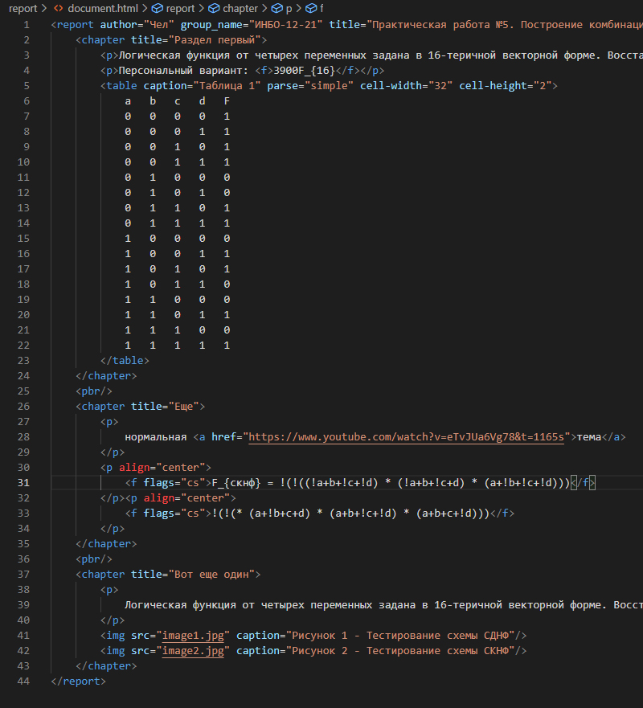
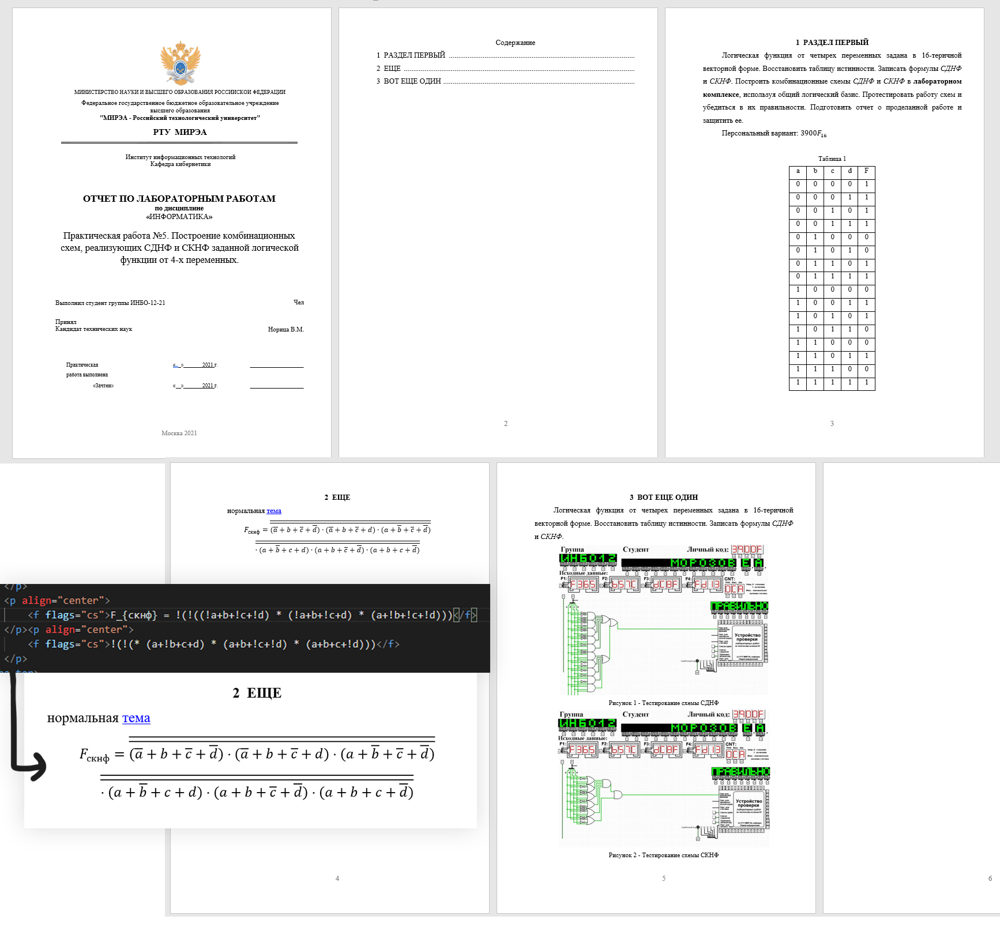

# docx report generator

## Что делает
Копирует документ с титульным листом `res/title_page.docx` и добавляет в него отформатированное содержимое упрощенного html файла (подобного этому [report/document.html](report/document.html)). Сгенерированный docx документ содержит то форматирование, которое требуется соблюдать в отчете.
Упрощен ввод [формул](#формулы), формулы можно записывать в формате [latex](https://ru.overleaf.com/learn/latex/Mathematical_expressions), который тоже немного упрощен.

document.html                  |  generated.docx
:-----------------------------:|:-------------------------:
 | 

## Возможности
* Автоматическое заполнение полей титульного листа.
* Автоматическое создание блока содержания с перекрестными ссылками на страницы разделов (открыв сгенерированный документ в ворде их можно обновить так: `Ctrl+A > ПКМ > обновить поле`)
* Простая запись [формул](#формулы).
* Запись простейших [таблиц](#таблицы).
* Добавление [изображений](#изображения) с диска.
* Использование [переменных](#переменные)

## Использование
Для работы нужен `python 3.8+`  
### Установка зависимостей
```
> pip install -r requirements.txt
```
### CLI
```
> python report_generator.py --help
report_generator.py [-h] [--title-page TITLE_PAGE] html_document output
positional arguments:
  html_document         path to .html document
  output                path to the .docx file to be generated

optional arguments:
  -h, --help            show this help message and exit
  --title-page TITLE_PAGE
                        path to title page .docx file
```
пример
```
> python report_generator.py "report/document.html" "report/generated.docx"
```

## Элементы html документа
### Структура
* `<report author="студент" group_name="инбо..." title="заголовок" recipient_status="че за препод" recipient="препод">` - корень документа. его аттрибуты используются в замене данных в титульном листе.
* `<chapter title="Раздел первый">` - раздел.
* `<p>` - параграф. `<p align="center">` - расположен в центре.
* `<pbr/>` - разрыв страницы.
### Текст
* `<a href="https://"></a>` - ссылка.
* `<b>` - жирный текст.
* `<i>` - курсив.
### Формулы
* `<f flags="cs" label="1">` - формула в формате [latex](https://ru.overleaf.com/learn/latex/Mathematical_expressions).  
Флаг `cs` (*`computer science`*) отвечает за некоторые дополнительные функции:  
`!a` или `!(a+b...)` - отрицание, превращается в выражение с чертой сверху.  
`v` - символ дизъюнкции. `^` - символ конъюнкции.  
(для разрыва формул лучше использовать несколько параграфов, как [тут](report/document.html))
### Изображения
* `` - изображение.  
`src` принимает путь к локальному файлу, относительно html документа.  
`caption` - подпись.
`width` - ширина в сантиметрах.
`height` - высота в сантиметрах.
### Таблицы
* `<table caption="Таблица 1" parse="simple" cell-width="32" cell-height="2">` - таблица.  
`caption` - подпись.  
`parse="simple"` - для упрощенного чтения.  
`cell-width` - ширина ячейки в пикселях.
`cell-height` - высота ячейки в пикселях.  
пример таблицы можно посмотреть [здесь](report/document.html)
### Переменные
* `<var name="имя_переменной">value</var>` - переменная.  
`name` - имя переменной.  
*value* - значение. может быть текстом, числом.  
ссылки на переменные, в любом месте документа, будут заменены на их значения, они записываются так: `$имя_переменной`  
пример: ``